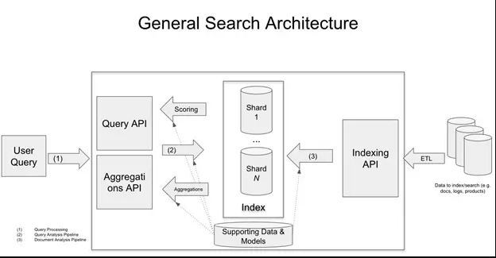

# Pre-read material

##  “ranking engine” or an “importance engine” for data

Search engines are really good at taking in **a fuzzy notion of what a user is looking for** and then finding, filtering, and ultimately ranking multi-structured (e.g. text, keywords, links, numbers, prices) content and returning it to users so that they can make a decision on next steps. After that initial data selection, modern search engines further excel in slicing and dicing the retrieved data for deeper analysis. This process is often called **“faceting” or “aggregations”** and **usually involves summarizing or otherwise analyzing the data to provide users with different ways of interacting with it**. For instance, on Amazon, result data is often turned into facets on the left side of the screen.


## History of search

- ["As We May Think"](https://en.wikipedia.org/wiki/As_We_May_Think) 1945, Vannevar Bush imagined a future in which people could access information using a ["memex"](https://en.wikipedia.org/wiki/Memex) that indexed all potentially useful content through "associative trails" modeled after the way the human brain organizes long-term memory.
- 1960s research group at Cornell built the first modern information retrieval system
- 1990s emergence of the World Wide Web
- Google
  - MapReduce](https://en.wikipedia.org/wiki/MapReduce): scales the indexing process by distributing computation across servers
  - PageRank](https://en.wikipedia.org/wiki/PageRank): link analysis to determine the importance of a web page.


*Users communicating their needs to a system and the system responding with content to satisfy those needs.*

Use cases:
- web
- ecommerce
- enterprise
- local
- legal
- machine generated data

**Known Search versus exploratory search.**


## Components of a Search Application

- ingestion (crawling or connecting) E(xtract) part of ETL, transform & load are part of the indexing process.
- search box
- autocomplete
- spelling correction
- results
- query refinement and faceting (summarize or aggregate the search results)


## Key Search Concepts

Three key subsystems: 
- an index subsystem to represent content for efficient search and aggregation
- a query subsystem to retrieve and rank query results from the index
- a aggregation subsystem to produce summary statistics about the set of query results.



### Relevance
- subjective
- approximate by averaging relevancy judgement
- important but there are other considerations such as popularity
- treatment of relevance will move back and forth between indexing and querying


### Ranking scores
- query dependant factors signal the relevance.
- non query dependant factors ignore the query, instead focusing on document features that signal value, such as popularity or recency.

### Indexing
- inverted index strings (the tokens) to sorted arrays of document ids (occurrences)
- a basic inverted index does not store positional information
- there is no weighting information indicating how important a token is to a particular document

**Stop words** - highly common words that can often be ignored without affecting the meaning of a search query or document

**Synonyms** – that is, two words with the same meaning like “short” and “brief” – will have distinct entries in an inverted index

**A word with multiple meanings**, like “lead”, only gets one entry in the inverted index, unless we use a highly sophisticated analyzer to perform [word-sense disambiguation](https://en.wikipedia.org/wiki/Word-sense_disambiguation)

#### Boosts
- boost by document importance
- assign importance to various document fields & boost by those (often a crude proxy for query understanding)

#### Weighting
- term frequency (tf), potentially normalized to document length to distinguish how important a repeated token is to a document
- inverse document frequency (idf) for tokens that occur in fewer documents is more important to the documents it does appear in (domain context)
- the combination is the tf-idf measure

### Analyzers
Process content into tokens in order to make searchable. **We must use the same analyzer for queries, so that the query text generates the same tokens we indexed.**
- character filtering, move to lower case, remove or standardize accents (optionally also Unicode normalization)
- tokenization (popular is to split on whitespace)
- stemming, remove endings to obtain main essence of the word
- remove stop words

### Query processing
We take the inputted query and apply the following processes:
- analyzer
- segmentation / entity recognition
- query expansion
- query classification
- spelling correction

resulting in typically a Boolean expression or an abstract syntax tree that can be used both to retrieve results from the index and to supply the ranking function with inputs for query-dependent factors.

#### Common search operators
- `AND/ OR`
- `+/-` (+) require or (-) disallow the token to the immediate right of the operator
- `""` for phases or exact matches
- `()` group tokens
- `term/clause boost` tell the wuery engine that a particular term or clause has a higher or lower weight than non-boosted terms

### Ranking
 A simple example: score by sum of tf-idf of the matched tokens and rank on this score. Also can have multi stage approaches.
 - score of a given document is specific to a give query (therefore not comparable for other queries)
 - analzer for the query processing need to be comparable (if not identical) to that used for tokenization
 - you may change retrieval and ranking approach for certain queries (eg longer ones)
 - remember the search box is where users express themselves!

### Aggregation and Facets
Aggregation provides a framework for summarizing the entire set of search results, which is highly useful for both populating dashboards and supporting search refinements.
- forward index map, maps each document to some of its field values. In order for those values to be available for aggregation, they are usually stored in memory.
- faceted search (early 2000s) helps navigate large result sets
- nested aggregations

## OpenSearch

Basics using ipython

```python
from opensearchpy import OpenSearch
import json
host = 'localhost'
port = 9200
auth = ('admin', 'admin') # For testing only. Don't store credentials in code.

# Create the client with SSL/TLS enabled, but hostname and certification verification disabled.
client = OpenSearch(
    hosts = [{'host': host, 'port': port}],
    http_compress = True, # enables gzip compression for request bodies
    http_auth = auth,
    # client_cert = client_cert_path,
    # client_key = client_key_path,
    use_ssl = True,
    verify_certs = False,
    ssl_assert_hostname = False,
    ssl_show_warn = False,
)

# Do a few checks before we start indexing:
print(client.cat.health())
print(client.cat.indices())

# If you still have your documents from the Dev Tools test, we should be able to check them here:
print(client.cat.count("search_fun_test", params={"v":"true"}))
```

### Indexing


```python
# Create an index with non-default settings.
index_name = 'search_fun_revisited'
index_body = {
  'settings': {
    'index': {
      'query':{
          'default_field': "body"
      }
    }
  }
}

response = client.indices.create(index_name, body=index_body)
print('\nCreating index:')
print(response)
```
```
Creating index:
{'acknowledged': True, 'shards_acknowledged': True, 'index': 'search_fun_revisited'}
```
#### Bulk indexing

```python
from opensearchpy.helpers import bulk
bulk(client, docs)
```

### Querying

```python
q = 'dogs'
index_name = 'search_fun_revisited_custom_mappings'
query = {
  'size': 5,
  'query': {
    'multi_match': {
      'query': q,
      'fields': ['title^2', 'body']
    }
  }
}

client.search(
    body = query,
    index = index_name
)
```

Querying with a `slop` aka `sloppy` phrase query (equivalent of ANDing or ORing the two terms together)

```python
q = 'fox dog'
query = {
  'size': 5,
  'query': {
    'match_phrase': {
      'body': {"query": q, "slop":10}
    }
  }
}

client.search(
    body = query,
    index = index_name
)
```