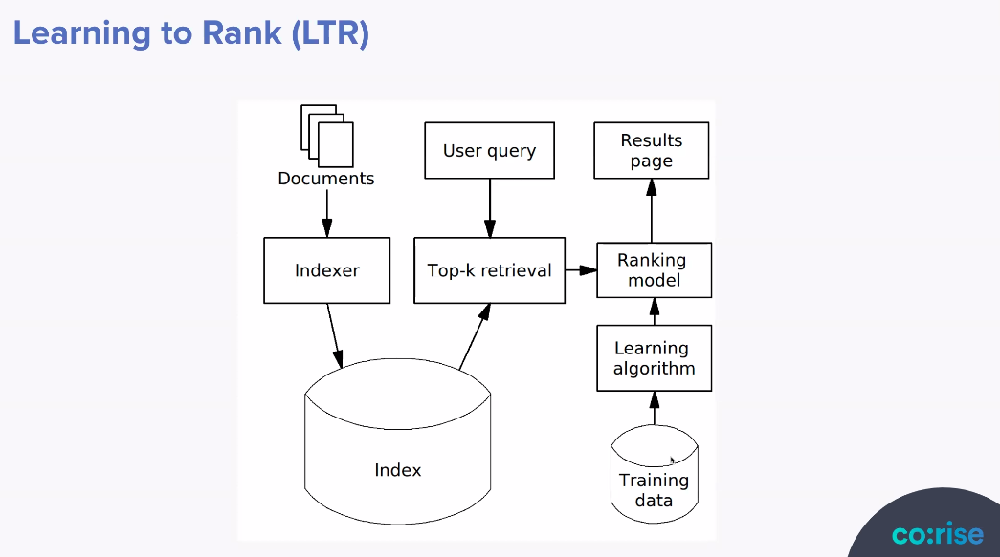

# Search under the hood

🗣️ 🤖 *Users communicating their needs to a system and the system responding with content to satisfy those needs.*

Search engines are really good at taking in **a fuzzy notion of what a user is looking for** and then finding, filtering, and ultimately ranking multi-structured (e.g. text, keywords, links, numbers, prices) content and returning it to users so that they can make a decision on next steps. After that initial data selection, modern search engines further excel in slicing and dicing the retrieved data for deeper analysis. This process is often called **“faceting” or “aggregations”** and **usually involves summarizing or otherwise analyzing the data to provide users with different ways of interacting with it**. For instance, on Amazon, result data is often turned into facets on the left side of the screen.

In ["As We May Think"](https://en.wikipedia.org/wiki/As_We_May_Think) (1945), Vannevar Bush imagined a future in which people could access information using a ["memex"](https://en.wikipedia.org/wiki/Memex) that indexed all potentially useful content through "associative trails" modeled after the way the human brain organizes long-term memory. In the 1960s a research group at Cornell built the first modern information retrieval system and things really took off with the emergence of the World Wide Web in the 1990s. Two important game changes for search, both from Google were [MapReduce](https://en.wikipedia.org/wiki/MapReduce) which scales the indexing process by distributing computation across servers and [PageRank](https://en.wikipedia.org/wiki/PageRank) which does link analysis to determine the importance of a web page.

Today there are many different use cases for search (web, e-commerce, enterprise, local, legal etc)

## Components of a Search Application

- **Ingestion** (crawling or connecting) the E(xtract) part of ETL, transform & load are part of the indexing process.
- **Search box** - where users express themselves!
- **Autocomplete**
- **Spelling correction**
- **Results**
- **Query refinement and faceting** - summarize or aggregate the search results

There are three key subsystems: 
- an index subsystem to represent content for efficient search and aggregation
- a query subsystem to retrieve and rank query results from the index
- a aggregation subsystem to produce summary statistics about the set of query results.

## Components of search system

- **Content understanding** represents each piece of content in the index.
- **Query understanding** represents each search query as a search intent.
- **Relevance of content** is a function of query and content understanding.
- **Ranking orders the relevant**, retrieved content by its desirability.

---

## Ranking & Relevance
 
*“how well a retrieved document or set of documents meets the information need of the user”.*

We need to infer what the user wants through collecting judgments, either by manually assigning labels and classifying results or through implicit behavior (ie clicks). It's therefore very important to have logs that we can then mine for information.

A simple approach to ranking would be to assign a score to each document using the sum of the tf-idf (term frequency - inverse document frequency).

Improving relevance is mostly about better representing the signals from documents, queries, and users

**Index:** improve the way the content is represented, including by making better use of external resources. Includes content understanding.

**Query:** improve the way the query is represented, rewriting it or otherwise transforming it before using it for scoring. Includes query understanding.

**Retrieval:** since retrieval determines which results will be scored, make sure it’s doing a good job of balancing precision and recall before the ranker scores its results.

**Scoring:** this is what most people think of as the core of relevance. And indeed it’s important, especially after you’ve done what you can with the index, query, and retrieval.

**Think about how to solicit the best input from your users.**

We can also use analyzers to process our queries and documents in our index, a simple example here would be the use of stemming where we remove common endings from a word. **Remember** it is very important to use the same analyzer for training your data as you will for the user inputs.

### Metrics for measuring relevancy

- Precision
	- true positive / true positive + false positive
	- we value precision when it's important to us the results returned are definitely of the correct class (little false positives)
- Recall
	- true positive / false negatives + true positives
	- we value it when we want to collect more results and are willing to risk some of them not be the of the right class.
*There is normally a compromise between these two (when precision is high recall might be lower)*
I highly recommend this [video](https://www.youtube.com/watch?v=BYQQlCVt4aE&ab_channel=CassieKozyrkov) on precision and recall by Cassie Kozyrkov.
- Mean Reciprocal Rank (MRR)
	- for each query, take the reciprocal (the reciprocal of x is 1/x) of the position of the first relevant or clicked document and then take the mean across all queries.

We can also use vectors and token weight to determine document similarity. A cosine of 1 means that two vectors are pointing in the same direction, so cosines between two documents that are close to 1 mean the documents are similar.

### LTR (Learning To Rank)

LTR is the application of machine learning (ML) to construct a ranking model for our search system. It usually relies on supervised learning approach and promotes relevant or desirable content over other results. Libraries for implementing it include [XGBoost](https://xgboost.readthedocs.io/) and [Ranklib](https://sourceforge.net/p/lemur/wiki/RankLib/)

We first create a training data set and add judgments to it, either explicit human judgments or implicit judgments gained from behavior such as when a user has clicked on something).

⚠️ Beware

- clicks don't always tell us whether the user found something relevant, think about snippets that a user might read but not click or presentation bias: you can only learn about results users see

We can now train and test our model, we might want to visualize the output of model to better understand how it is making decisions. How to do this will depend on the tech we have chosen to use.

---

## Appendix
### Query dependant/ independent signals

Query-dependent signals are good for determining relevance. Query-independent signals are good for determining desirability.

| Query dependent                 | Query Independent (document boosts)  |
|---------------------------------|--------------------------------------|
|  # of matching tokens           | popularity                           |
|  tokens matching specific field | recency                              |
|  tf-idf, BM25 scores            | price                                |
|  synonyms                       | sale rank                            |

 ### tf (term frequency)
 A token that is repeated in a document is more important to the document.

### idf (inverse document frequency
A token that occurs in fewer documents in the index is more important to the documents in which it occurs.  

 ### Known Search versus exploratory search
 - known search is where the user already has an idea what they are looking for
 - exploratory search

 ### Relevance
- subjective
- approximate by averaging relevancy judgement
- important but there are other considerations such as popularity
- treatment of relevance will move back and forth between indexing and querying

### Ranking scores
- query dependant factors signal the relevance.
- non query dependant factors ignore the query, instead focusing on document features that signal value, such as popularity or recency.

### Indexing
- inverted index strings (the tokens) to sorted arrays of document ids (occurrences)
- a basic inverted index does not store positional information
- there is no weighting information indicating how important a token is to a particular document

### Stop words
highly common words that can often be ignored without affecting the meaning of a search query or document

### Synonyms
two words with the same meaning like “short” and “brief” – will have distinct entries in an inverted index

Note that a word with multiple meanings, like “lead”, only gets one entry in the inverted index, unless we use a highly sophisticated analyzer to perform [word-sense disambiguation](https://en.wikipedia.org/wiki/Word-sense_disambiguation)

### Boosts
- boost by document importance
- assign importance to various document fields & boost by those (often a crude proxy for query understanding)

### Weighting
- term frequency (tf), potentially normalized to document length to distinguish how important a repeated token is to a document
- inverse document frequency (idf) for tokens that occur in fewer documents is more important to the documents it does appear in (domain context)
- the combination is the tf-idf measure

### Analyzers
Process content into tokens in order to make searchable. **We must use the same analyzer for queries, so that the query text generates the same tokens we indexed.**

- character filtering, move to lower case, remove or standardize accents (optionally also Unicode normalization)
- tokenization (popular is to split on whitespace)
- stemming, remove endings to obtain main essence of the word
- remove stop words

### Query processing
We take the inputted query and apply the following processes:
- analyzer
- segmentation / entity recognition
- query expansion
- query classification
- spelling correction

resulting in typically a Boolean expression or an abstract syntax tree that can be used both to retrieve results from the index and to supply the ranking function with inputs for query-dependent factors.

### Common search operators
- `AND/ OR`
- `+/-` (+) require or (-) disallow the token to the immediate right of the operator
- `""` for phases or exact matches
- `()` group tokens
- `term/clause boost` tell the wuery engine that a particular term or clause has a higher or lower weight than non-boosted terms

### Ranking
 A simple example: score by sum of tf-idf of the matched tokens and rank on this score. Also can have multi stage approaches.
 - score of a given document is specific to a give query (therefore not comparable for other queries)
 - analyzer for the query processing need to be comparable (if not identical) to that used for tokenization
 - you may change retrieval and ranking approach for certain queries (eg longer ones)
 - remember the search box is where users express themselves!

## Aggregation and Facets
Aggregation provides a framework for summarizing the entire set of search results, which is highly useful for both populating dashboards and supporting search refinements.
- forward index map, maps each document to some of its field values. In order for those values to be available for aggregation, they are usually stored in memory.
- faceted search (early 2000s) helps navigate large result sets
- nested aggregations